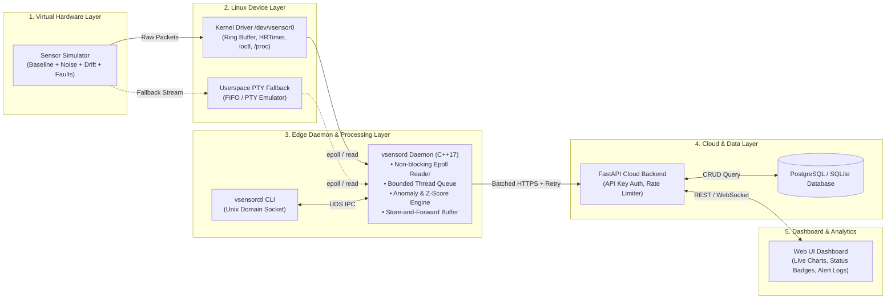

# VSense-HIL: Virtual Sensor Hardware-in-the-Loop Telemetry Engine

## 1. Project Overview & Metadata
* **Project Title:** VSense-HIL: Virtual Sensor Telemetry Engine
* **Domain:** Domain 1: IoT, Embedded & Virtual Sensors
* **Pipeline:** Virtual Device → Linux → Device Interface/Driver → C++ System Programming → Data Processing → Cloud → Database → Dashboard
* **Target OS:** Ubuntu 22.04/24.04 Linux (with reproducible Docker/devcontainer fallback environment)
* **Hardware Disclaimer:** *All hardware simulated in software for Hardware-in-the-Loop (HIL) telemetry testing.*

---

## 2. Problem Statement
Industrial IoT and embedded telemetry systems rely on high-frequency, reliable sensor data collection to monitor critical machinery, energy systems, and smart factory infrastructure. However, developing, testing, and validating end-to-end telemetry pipelines against physical hardware presents severe operational challenges:
1. **Physical Hardware Scarcity & Cost:** Physical sensor arrays and edge devices are expensive, difficult to allocate to every developer, and prone to physical wear or damage during stress testing.
2. **Deterministic Fault Testing:** Injecting rare, extreme edge cases (e.g., sudden voltage spikes, sensor dropouts, out-of-range thermal runaways, signal noise, stuck-at faults) on physical hardware is dangerous, non-deterministic, and destructive.
3. **Kernel-to-Cloud Integration Complexity:** Embedded engineers frequently struggle to validate low-latency kernel device driver interactions, zero-copy buffer management, systemd daemon reliability, and cloud network resilient store-and-forward mechanisms in a unified test environment.

---

## 3. Project Motivation
The **VSense-HIL Telemetry Engine** addresses these challenges by delivering an end-to-end, software-based Hardware-in-the-Loop (HIL) testbed and telemetry pipeline. By synthesizing high-fidelity virtual sensors at the signal generator level, exposing them through a Linux kernel character device driver (with userspace PTY fallback), processing them via a non-blocking C++17 system daemon, and streaming validated telemetry to a cloud REST/WebSocket backend with real-time dashboards, VSense-HIL bridges low-level system programming with cloud IoT analytics.

---

## 4. Objectives
The primary technical objectives of VSense-HIL are:
* **Realistic Signal Synthesis:** Emulate multi-modal sensor signals (Temperature, Humidity, Pressure, Vibration, Voltage, Current) with baseline drift, Gaussian noise, and dynamic fault injection (spikes, stuck-at, dropouts, out-of-range).
* **Low-Level Linux System Interfacing:** Develop a custom Linux kernel character driver (`/dev/vsensor0`) utilizing ring buffers, `hrtimer` interrupts, wait queues, and `ioctl` control calls (with an epoll-compatible userspace PTY emulator fallback for containerized environments).
* **High-Performance C++ Telemetry Daemon (`vsensord`):** Implement non-blocking I/O (`epoll`), RAII-managed device readers, thread-safe lock-free/bounded producer-consumer queues, real-time anomaly detection (z-score + moving averages), and local SQLite buffering with spdlog audit logging.
* **Fault-Tolerant Cloud Telemetry Pipeline:** Engineer a batched HTTPS client featuring exponential backoff, persistent store-and-forward buffering, and a scalable FastAPI cloud backend with PostgreSQL/SQLite, API key authentication, and rate limiting.
* **Interactive Live Dashboard:** Provide an intuitive web dashboard demonstrating live sensor streams, health metrics, historical trends, alert logs, and runtime fault injection capabilities.

---

## 5. Scope
The project encompasses:
* **Virtual Sensor Generator:** Python/C++ configurable simulator driven by YAML/JSON profiles and runtime IPC control.
* **Linux Kernel Device Driver & PTY Emulator:** `vsensor.ko` kernel module with `/proc/vsensor` stats, `sysfs` configuration, udev rules, plus `vsensor_emulator` for containerized dev environments.
* **C++ Core Daemon (`vsensord`) & CLI (`vsensorctl`):** C++17 system service with Unix domain socket IPC for live management and fault triggering.
* **Cloud Telemetry Backend:** FastAPI server with full OpenAPI documentation, rate limiting, and database models.
* **Web UI Dashboard:** Chart.js / WebSocket live telemetry dashboard with hardware simulation indicators.
* **DevOps & Verification Suite:** Docker Compose environment, GoogleTest unit test framework, pytest backend suite, and system fault-injection test scripts.

---

## 6. Expected Outcomes
1. A fully reproducible end-to-end software pipeline running on Ubuntu 22.04/24.04 or Docker.
2. Verified zero-loss telemetry handling under cloud network disconnect scenarios via local store-and-forward buffering.
3. Sub-millisecond local anomaly detection and real-time visualization of injected sensor faults.
4. Comprehensive technical documentation, architectural diagrams, PRD, test results, and deployment guides suitable for academic and industrial presentation.

---

## 7. Target Applications
* **Industrial HIL Testing:** Testbed for industrial machinery telemetry prior to physical deployment.
* **Automotive & Aerospace Edge Computing:** Simulating engine thermals, vibration levels, and electrical power metrics.
* **IoT Firmware & Middleware Validation:** Benchmarking daemon resilience, ring-buffer overflows, and network outage behavior.
* **Academic Embedded Systems Education:** Complete reference implementation spanning Linux kernel driver development, C++ system programming, IPC, and cloud engineering.

---

## 8. System Limitations
* **Simulated Hardware:** All sensor hardware signals are mathematically generated in software; no physical I2C/SPI/ADC pins are sampled.
* **Host OS Dependencies:** The native kernel module `vsensor.ko` requires standard Linux kernel headers (`linux-headers-$(uname -r)`) and root permissions (`sudo insmod`). When running inside restricted containers or non-Linux hosts (e.g., Windows WSL without custom kernel support), the userspace PTY emulator fallback is utilized.

---

## 9. Future Possibilities
* Addition of OPC-UA and MQTT protocol bindings alongside HTTPS telemetry ingest.
* Extension of anomaly detection algorithms to include ONNX runtime edge ML model inference (e.g., Autoencoder anomaly detection).
* Hardware integration with real Raspberry Pi / STM32 edge microcontrollers via SPI/I2C bridge.

---

## 10. Initial End-to-End Architecture Diagram

---
*Note: All hardware is simulated for educational and system validation purposes.*
