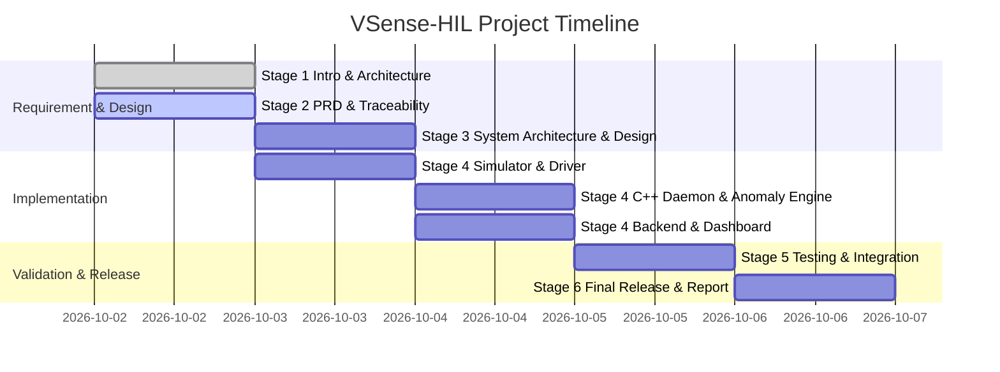

# Product Requirements Document (PRD)

**Project Title:** VSense-HIL: Virtual Sensor Telemetry Engine  
**Document Version:** 1.0  
**Status:** Approved  
**Author:** Technical Lead & Embedded Systems Architect  

---

## 1. Functional Requirements (FR)

| Requirement ID | Module | Description | Priority | Verification Method |
| :--- | :--- | :--- | :--- | :--- |
| **FR-01** | Simulator | Generate synthetic multi-modal telemetry for 6 sensors: Temperature (°C), Humidity (%), Pressure (hPa), Vibration (mm/s), Voltage (V), Current (A). | High | Unit Test / Inspection |
| **FR-02** | Simulator | Support baseline signal generation with configurable Gaussian noise and linear/exponential drift. | Medium | Script Validation |
| **FR-03** | Simulator | Enable dynamic runtime injection of 4 fault modes: Spike, Stuck-at, Dropout, and Out-of-Range. | High | Integration Test |
| **FR-04** | Driver | Provide Linux kernel character device `/dev/vsensor0` supporting standard `file_operations` (`open`, `read`, `write`, `poll`, `release`). | Critical | Kernel Driver Test |
| **FR-05** | Driver | Implement custom `ioctl` calls for setting sample rates, sensor selection, driver reset, and status retrieval. | High | C Test Harness |
| **FR-06** | Driver | Maintain internal lock-protected ring buffer and kernel `hrtimer` for deterministic sample emission. | High | Benchmark Test |
| **FR-07** | Driver | Provide userspace PTY/FIFO fallback emulator exposing identical binary packet interface for non-root/containerized execution. | Critical | Fallback Verification |
| **FR-08** | Daemon | Non-blocking `epoll`/`poll` `DeviceReader` in C++17 to ingest packets without thread starvation. | Critical | Stress Test |
| **FR-09** | Daemon | Bounded, lock-protected thread-safe queue connecting I/O reader thread with processing pipeline threads. | Critical | C++ GoogleTest |
| **FR-10** | Daemon | Validation engine checking timestamp monotonicity, sequence gap detection, range checks, and NaN/Inf validation. | High | GoogleTest Unit Suite |
| **FR-11** | Daemon | Real-time Anomaly Engine combining static thresholds and rolling-window Z-Score + Moving Averages. | Critical | GoogleTest Unit Suite |
| **FR-12** | Daemon | State machine maintaining device state transitions (`NORMAL` → `WARNING` → `CRITICAL` → `RECOVERY`). | High | State Machine Test |
| **FR-13** | Daemon | Persistent Store-and-Forward local buffer (SQLite) preventing data loss during network/cloud outages. | Critical | Fault-Injection Test |
| **FR-14** | CLI | `vsensorctl` command-line utility communicating over Unix Domain Socket for live query, threshold updates, and fault injection. | Medium | CLI Script Test |
| **FR-15** | Cloud | FastAPI cloud REST API exposing ingest (`POST /api/v1/telemetry`), latest telemetry, historical query, alerts, and system health endpoints. | High | pytest API Suite |
| **FR-16** | Cloud | Enforce API Key authentication header (`X-API-Key`) and IP rate limiting middleware. | High | Security Test |
| **FR-17** | Dashboard | Interactive Web Dashboard displaying live gauge widgets, Chart.js time series, state badges, alert tables, and runtime fault injection triggers. | High | UI Browser Test |

---

## 2. Non-Functional Requirements (NFR)

| Requirement ID | Category | Metric / Specification | Target Value |
| :--- | :--- | :--- | :--- |
| **NFR-01** | Performance | Ingestion Throughput | ≥ 1,000 samples/sec |
| **NFR-02** | Performance | End-to-End Latency (Device to Dashboard) | < 100 ms local |
| **NFR-03** | Reliability | Data Loss Rate during 60s network disconnect | 0.0% (Store-and-Forward) |
| **NFR-04** | Resource Efficiency | Daemon CPU Usage | < 5% single-core |
| **NFR-05** | Resource Efficiency | Daemon Memory Footprint | < 30 MB RSS |
| **NFR-06** | Security | Authentication & Transport | API Keys + TLS/HTTPS |
| **NFR-07** | Maintainability | Code Quality & Documentation | Modern C++17, PEP8, Doxygen |
| **NFR-08** | Portability | Cross-Environment Execution | Ubuntu 22.04/24.04, Docker, WSL2 |
| **NFR-09** | Robustness | Signal & Error Handling | Graceful shutdown on SIGINT/SIGTERM |
| **NFR-10** | Compliance | Transparency | Clear "Simulated Hardware" disclaimers |

---

## 3. Module List & System Deliverables

```text
/
├── simulator/          -> Python/C++ Signal Generator & Fault Injector
├── driver/             -> C Kernel Module vsensor.ko + PTY Userspace Emulator
├── daemon/             -> C++17 vsensord Telemetry Daemon & Anomaly Engine
├── cli/                -> C++/Python vsensorctl Control Utility
├── cloud-backend/      -> FastAPI REST API, Rate Limiter & SQLite DB
├── dashboard/          -> Modern Glassmorphism Web Dashboard & Chart.js
├── tests/              -> GoogleTest, pytest, and Fault Injection Scripts
└── deploy/             -> Dockerfile and Docker Compose Config
```

---

## 4. Risk Analysis & Mitigation Matrix

| Risk ID | Risk Description | Impact | Probability | Mitigation Strategy |
| :--- | :--- | :--- | :--- | :--- |
| **R-01** | Missing Linux kernel headers or lack of root privileges in containerized host. | High | High | Implement userspace PTY emulator (`vsensor_emulator`) that mirrors kernel driver binary packet protocol. |
| **R-02** | Queue overflow under high frequency sensor sample floods. | High | Medium | Implement bounded lock-free/mutex queue with drop-oldest / backpressure strategies and configurable queue depth. |
| **R-03** | Transient network outages causing telemetry loss. | High | High | Implement local SQLite store-and-forward buffer with exponential backoff retries. |
| **R-04** | Thread race conditions in daemon state machine or anomaly detector. | High | Medium | Protect shared state with mutexes, atomic variables, and validate with ThreadSanitizer (TSan). |

---

## 5. Development Timeline (Gantt Chart)



---

## 6. Requirements Traceability Matrix (RTM)

| Requirement | Module Implementation | Verification Test Suite |
| :--- | :--- | :--- |
| **FR-01, FR-02** | `simulator/sensor_sim.py` | `tests/test_simulator.py` |
| **FR-03** | `simulator/sensor_sim.py` | `scripts/fault_injection.py` |
| **FR-04, FR-05, FR-06** | `driver/vsensor.c` | `tests/test_driver.c` |
| **FR-07** | `driver/vsensor_pty_emulator.py` | `tests/test_emulator.py` |
| **FR-08, FR-09** | `daemon/src/DeviceReader.cpp` | `tests/test_queue.cpp` |
| **FR-10, FR-11, FR-12** | `daemon/src/AnomalyDetector.cpp` | `tests/test_anomaly.cpp` |
| **FR-13** | `daemon/src/StoreAndForward.cpp` | `tests/test_storage.cpp` |
| **FR-14** | `cli/vsensorctl.cpp` | `tests/test_cli.sh` |
| **FR-15, FR-16** | `cloud-backend/main.py` | `tests/test_backend.py` |
| **FR-17** | `dashboard/index.html` | Browser E2E Inspection |
