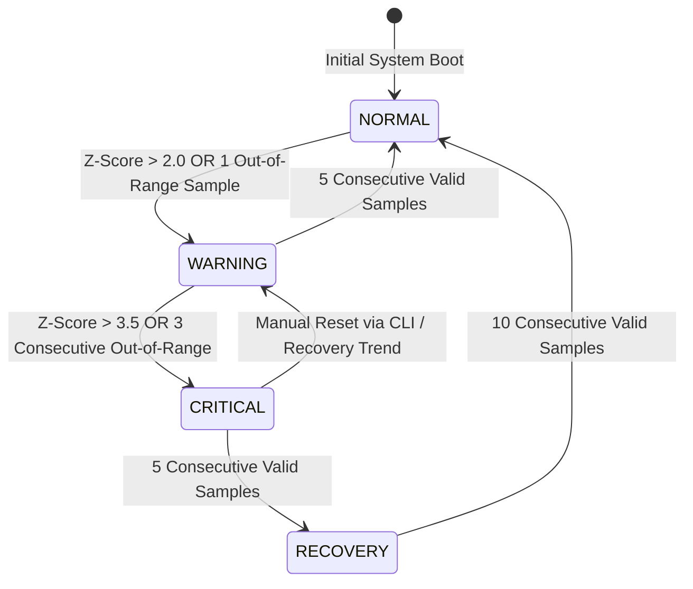
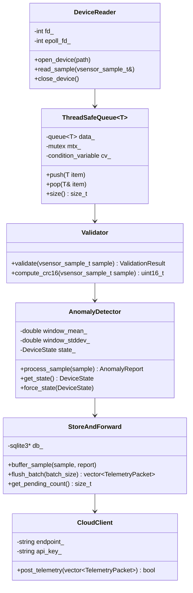

# System Design & Architecture Document

**Project Title:** VSense-HIL: Virtual Sensor Telemetry Engine  
**Document Version:** 1.0  
**Status:** Approved  
**Author:** Technical Lead & Systems Architect  

---

## 1. System Architecture & Data Flow

```mermaid
flowchart TD
    subgraph S1["Virtual Hardware & Emulation Layer"]
        SIM["Sensor Simulator<br/>(Python/C++)"]
        FAULT["Fault Injector<br/>(Spike, Stuck, Dropout, Out-of-Range)"]
        FAULT --> SIM
    end

    subgraph S2["Linux Device Layer"]
        KDRIVER["Linux Kernel Driver /dev/vsensor0<br/>• hrtimer Sample Engine<br/>• Spinlock Ring Buffer<br/>• ioctl & sysfs/procfs"]
        EMU["Userspace PTY Emulator<br/>(Container / Non-Root Fallback)"]
        SIM -->|Raw C-Struct Bytes| KDRIVER
        SIM -->|Raw C-Struct Bytes| EMU
    end

    subgraph S3["C++ Telemetry Daemon (vsensord)"]
        READER["DeviceReader<br/>(Non-blocking Epoll)"]
        QUEUE["ThreadSafeQueue<br/>(Bounded Bounded Queue)"]
        VAL["Validator<br/>(Range, CRC, Monotonicity)"]
        DETECTOR["AnomalyDetector & State Machine<br/>(Z-Score + Moving Avg)"]
        STOR["StoreAndForward<br/>(SQLite Local Buffer)"]
        HTTP["CloudClient<br/>(cURL Batched HTTPS)"]

        KDRIVER -->|read()| READER
        EMU -->|read()| READER
        READER -->|Enqueue| QUEUE
        QUEUE -->|Dequeue| VAL
        VAL --> DETECTOR
        DETECTOR -->|Valid Packets| STOR
        STOR -->|Batch Flush| HTTP
    end

    subgraph S4["Control & Management IPC"]
        CLI["vsensorctl CLI"]
        UDS["Unix Domain Socket Server<br/>(/tmp/vsensor.sock)"]
        CLI <-->|Status / Fault Control| UDS
        UDS <--> DETECTOR
    end

    subgraph S5["Cloud Backend & Dashboard"]
        BACKEND["FastAPI Cloud Backend<br/>(API Key Auth, Rate Limiter)"]
        DB[(SQLite / PostgreSQL DB)]
        DASH["Web Dashboard UI<br/>(Live Gauges, Chart.js, Alerts)"]

        HTTP -->|POST /api/v1/telemetry| BACKEND
        BACKEND <--> DB
        BACKEND <-->|REST & Polling/WS| DASH
    end
```

---

## 2. Low-Level Data Structures & Packet Binary Layout

### 2.1 C Driver Struct (`vsensor_sample_t`)
Packed binary structure transferred between kernel/PTY driver and `vsensord` daemon:

```c
#pragma pack(push, 1)
typedef struct {
    uint32_t magic;         /* 0x56534E53 ('VSNS') */
    uint32_t sensor_id;     /* 1=Temp, 2=Humidity, 3=Pressure, 4=Vibration, 5=Voltage, 6=Current */
    uint32_t sensor_type;   /* Enumerated sensor type code */
    double   value;         /* Floating-point sensor reading */
    uint64_t timestamp_ns;  /* UTC nanoseconds timestamp */
    uint64_t seq_num;       /* Monotonically increasing sequence number */
    uint16_t status_flags;  /* Bitmask: 0x01=OK, 0x02=NOISE, 0x04=SPIKE, 0x08=STUCK, 0x10=OUT_OF_RANGE */
    uint16_t crc16;         /* CRC16 checksum over fields */
} vsensor_sample_t;         /* Total Size: 40 bytes */
#pragma pack(pop)
```

---

## 3. Kernel Device Driver `ioctl` Interface

| Control Command | Command Code | Direction | Description |
| :--- | :--- | :--- | :--- |
| `VSENSOR_IOC_SET_RATE` | `_IOW('v', 1, uint32_t)` | In | Sets hrtimer sample rate in Hz (1 Hz to 1000 Hz). |
| `VSENSOR_IOC_SELECT_SENSOR` | `_IOW('v', 2, uint32_t)` | In | Filters or selects target sensor ID (1–6). |
| `VSENSOR_IOC_RESET` | `_IO('v', 3)` | None | Resets internal ring buffer pointers and sequence counters. |
| `VSENSOR_IOC_GET_STATUS` | `_IOR('v', 4, uint32_t[4])` | Out | Retrieves kernel stats: [samples_generated, dropped, buffer_head, buffer_tail]. |

---

## 4. State Machine Architecture (Device Health)



---

## 5. C++ Daemon (`vsensord`) Class Hierarchy



---

## 6. Database Schema (Cloud & Local SQLite Buffer)

### `telemetry_records` Table
```sql
CREATE TABLE IF NOT EXISTS telemetry_records (
    id INTEGER PRIMARY KEY AUTOINCREMENT,
    sensor_id INTEGER NOT NULL,
    sensor_name TEXT NOT NULL,
    sensor_type TEXT NOT NULL,
    value REAL NOT NULL,
    unit TEXT NOT NULL,
    timestamp_ns INTEGER NOT NULL,
    seq_num INTEGER NOT NULL,
    status_flags INTEGER NOT NULL,
    state TEXT NOT NULL,
    z_score REAL DEFAULT 0.0,
    created_at DATETIME DEFAULT CURRENT_TIMESTAMP
);
```

### `alerts` Table
```sql
CREATE TABLE IF NOT EXISTS alerts (
    id INTEGER PRIMARY KEY AUTOINCREMENT,
    sensor_id INTEGER NOT NULL,
    severity TEXT NOT NULL, /* INFO, WARNING, CRITICAL */
    rule_triggered TEXT NOT NULL,
    value REAL NOT NULL,
    message TEXT NOT NULL,
    timestamp DATETIME DEFAULT CURRENT_TIMESTAMP
);
```

---

## 7. JSON Telemetry REST Payload Schema

```json
{
  "device_id": "vsense-edge-01",
  "batch_size": 2,
  "telemetry": [
    {
      "sensor_id": 1,
      "name": "Temperature",
      "type": "THERMAL",
      "value": 42.5,
      "unit": "°C",
      "timestamp_ns": 1727889000000000000,
      "seq_num": 1042,
      "status_flags": 1,
      "state": "NORMAL",
      "z_score": 0.35
    },
    {
      "sensor_id": 4,
      "name": "Vibration",
      "type": "ACCELEROMETER",
      "value": 18.2,
      "unit": "mm/s",
      "timestamp_ns": 1727889000050000000,
      "seq_num": 1043,
      "status_flags": 4,
      "state": "WARNING",
      "z_score": 2.85
    }
  ]
}
```
